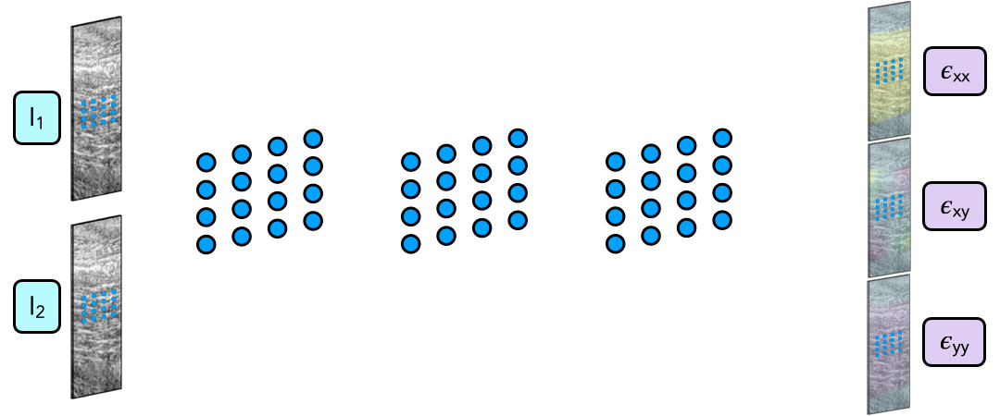

<!-- omit in toc -->
# StrainNet
StrainNet is a deep learning based method for predicting strain from images



### [Project Page](https://strainnet.net) | Paper | bioRxiv | SB3C Abstract | Citation

<br/>

<!-- omit in toc -->
# Table of Contents 
- [Getting Started](#getting-started)
- [Generating a training set](#generating-a-training-set)
- [Training StrainNet on the training set](#training-strainnet-on-the-training-set)
- [Evaluating the performance of StrainNet](#evaluating-the-performance-of-strainnet)
- [Testing StrainNet on experimental images](#testing-strainnet-on-experimental-images)

# Getting Started

Begin by cloning this repository:

```
git clone https://github.com/reecehuff/StrainNet.git
cd StrainNet
```
 

Next, install the necessary Python packages with Anaconda.
```
conda create -n StrainNet python=3.9
conda activate StrainNet
pip install -r requirements.txt
```

# Generating a training set

<!-- omit in toc -->
### For a full tutorial, see [generateTrainingSet/README.md](generateTrainingSet/README.md).

<br/>

# Training StrainNet on the training set 


# Evaluating the performance of StrainNet

# Testing StrainNet on experimental images

