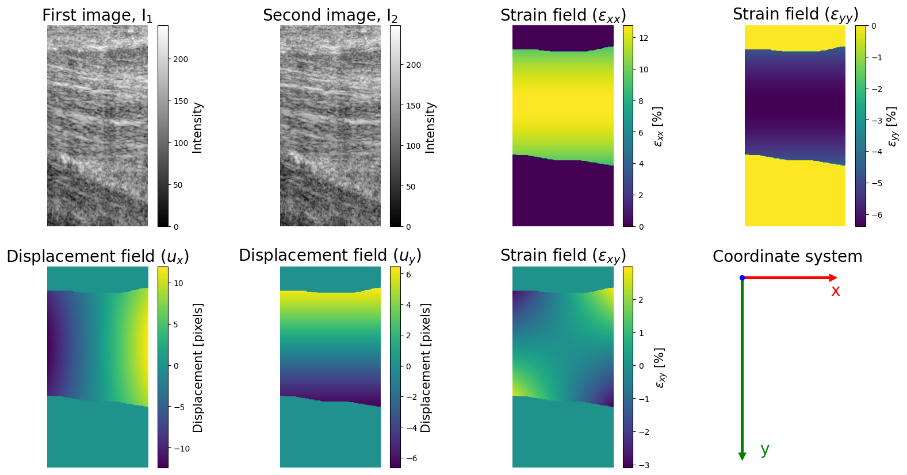

# Generating a Training Set for StrainNet

StrainNet is a two-stage deep neural network for measuring strain (i.e., deformation) from two successive images. In order to train the network, we need to provide a set of images and corresponding strain measurements as input. This subdirectory contains information and resources for generating a training set for StrainNet.

# TLDR

To get a feel for what this subdirectory does, simply run

```
python generateTrainingSet/generateTraining.py --visualize --N_tension 5 --N_compression 5 --N_rigid 5
```

This command will create a small training set of 5 examples of images undergoing tensile, compressive, and rigid deformation for a total of 15 examples. You should now see the complete training set in the `output` folder, i.e., 

```
📦output
 ┣ 📂compression
 ┃ ┣ 📂displacements
 ┃ ┣ 📂images
 ┃ ┣ 📂strains
 ┃ ┗ 📂visualize
 ┣ 📂rigid
 ┃ ┣ 📂displacements
 ┃ ┣ 📂images
 ┃ ┣ 📂strains
 ┃ ┗ 📂visualize
 ┣ 📂tension
 ┃ ┣ 📂displacements
 ┃ ┣ 📂images
 ┃ ┣ 📂strains
 ┃ ┗ 📂visualize
 ┗ 📜args.xlsx
```
 
Please look in one of the `📂visualize` folder to see an examples of deformations applied in the training set. For example, here is an example of tensile strain applied to the tendon: 



You'll note that is a non-linear strain field applied to the image over the region where the tendon exists. 

The set of images and strains are processed and split into training and validation sets and copied to the `datasets` folder, i.e., 

```
📦datasets
 ┗ 📂train_set_N_tension_10_N_compression_10_N_rigid_10
 ┃ ┣ 📂training
 ┃ ┃ ┣ 📂compression
 ┃ ┃ ┃ ┣ 📂images
 ┃ ┃ ┃ ┗ 📂strains
 ┃ ┃ ┣ 📂rigid
 ┃ ┃ ┃ ┣ 📂images
 ┃ ┃ ┃ ┗ 📂strains
 ┃ ┃ ┗ 📂tension
 ┃ ┃ ┃ ┣ 📂images
 ┃ ┃ ┃ ┗ 📂strains
 ┃ ┣ 📂validation
 ┃ ┃ ┣ 📂compression
 ┃ ┃ ┃ ┣ 📂images
 ┃ ┃ ┃ ┗ 📂strains
 ┃ ┃ ┣ 📂rigid
 ┃ ┃ ┃ ┣ 📂images
 ┃ ┃ ┃ ┗ 📂strains
 ┃ ┃ ┗ 📂tension
 ┃ ┃ ┃ ┣ 📂images
 ┃ ┃ ┃ ┗ 📂strains
 ┃ ┗ 📜args.xlsx
```

To create a much larger training set (the default arguments creates one with 3600 examples in total), run

```
python generateTrainingSet/generateTraining.py
```
*Note*: The ```--visualize``` flag was excluded mostly because it increases the run time significantly. 

# Full Tutorial 

TODO

